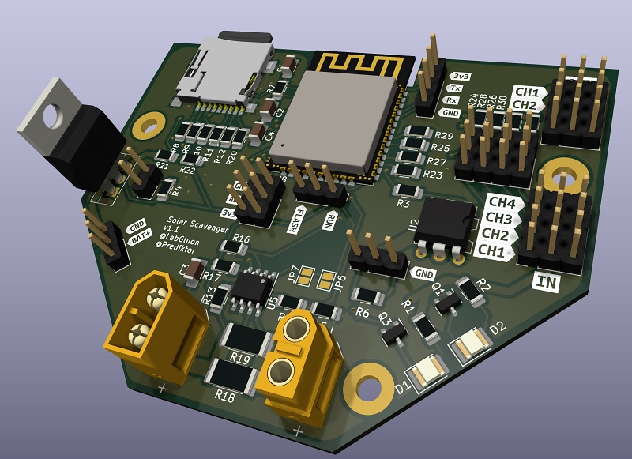
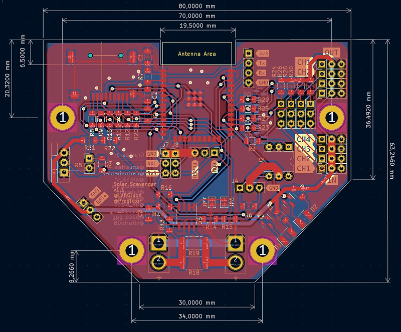

# Solar Scavenger

Os presento el barco **Solar Scavenger** participante de la VI Regata Solar en Baiona!

El resultado: Primer premio en diseño y tercero en regata!

Todo está desarrollado en directo, desde la PCB, diseño 3D, software y montaje! (Link abajo)

## Materiales usados:

| Nombre | Descripción |
|---|---|
| [A2212 1000 KV](https://s.click.aliexpress.com/e/_DB0ZUoN) | Motor brushless outrunner para el barco|
| [ESC 4S 40A](https://s.click.aliexpress.com/e/_DB3iqU5) | Controlador de velocidad ESC |
| [ESP32](https://s.click.aliexpress.com/e/_DdJJJ5L) | Cerebro del controlador |

## PCB

